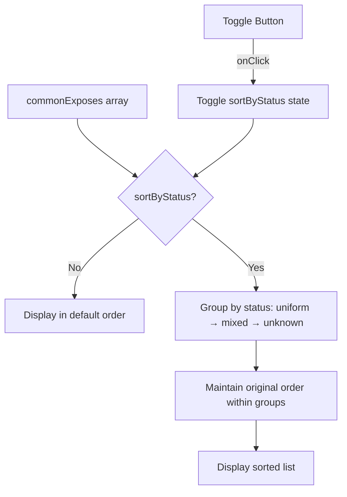

# Plan: Bulk Settings Sort Toggle

## Original Work Order

> Add a toggle to the bulk settings page to either sort in the default order, or to sort by feature state, which will first sort by the state being the same, mixed, or unknown, and then within each category use the same sorting as the default sorting.

## Executive Summary

This plan adds a simple toggle control to the Bulk Settings page that allows users to switch between two sorting modes for the common features list: default order (as returned by `computeCommonExposes`) and status-based order (grouped by uniform → mixed → unknown, preserving original order within each group).

The implementation is minimal: a single state variable for sort mode, a toggle button in the UI, and a sorting function that groups features by their value status. This helps users quickly identify features where all devices have matching values (uniform) vs those that need attention (mixed/unknown).

## Context

### Current State vs Target State

| Current State | Target State | Why? |
|---------------|--------------|------|
| Features are displayed in default order only | Users can toggle between default and status-based sorting | Helps users prioritize features where devices already agree vs need configuration |
| No sorting controls exist on the page | A toggle button allows switching sort modes | Provides user control over feature list organization |

### Background

The Bulk Settings page currently displays common features in the order returned by `computeCommonExposes()`. Each feature already has a computed `ValueStatus` (uniform, mixed, or unknown) stored in the `featureValueStatuses` Map. The sorting infrastructure is straightforward to add since all required data is already available.

## Architectural Approach

### Sort Mode State

**Objective**: Track the current sort mode selection.

Add a `sortByStatus` boolean state variable (default: `false`). When `false`, features display in default order. When `true`, features are sorted by value status with uniform first, mixed second, and unknown last.

### Toggle UI Control

**Objective**: Provide a simple control for users to switch sort modes.

Add a toggle button in the "Common Features" card header area, next to the feature count badge. Use a daisyUI toggle or button group styled consistently with the existing UI. The toggle should be labeled to indicate the current mode.

### Sorting Logic

**Objective**: Sort features by status while preserving relative order within status groups.

Create a `useMemo` that produces the sorted feature list:
1. If `sortByStatus` is false, return `commonExposes` unchanged
2. If true, sort with a comparator that:
   - Assigns priority: uniform=0, mixed=1, unknown=2
   - Compares by priority first
   - Uses original array index as tiebreaker to preserve default order within groups

## Risk Considerations and Mitigation Strategies

Technical Risks

- **Performance with many features**: Sorting on every render could be slow
    - **Mitigation**: Use `useMemo` with proper dependencies to only re-sort when data changes

## Success Criteria

### Primary Success Criteria

1. Toggle control is visible in the Common Features section
2. Clicking toggle switches between default and status-based sorting
3. Status-based sorting groups features as uniform → mixed → unknown
4. Original order is preserved within each status group
5. Toggle state persists while on the page (does not need persistence across navigation)

## Resource Requirements

### Development Skills

- front-end javascript
- front-end css and html

### Technical Infrastructure

- javascript
- typescript
- vite
- tailwind
- react

## Integration Strategy

- this project is a front end built on the websocket API of zigbee2mqtt.

## Execution Blueprint

**Validation Gates:**
- Reference: `/config/hooks/POST_PHASE.md`

### ✅ Phase 1: Implementation
**Parallel Tasks:**
- ✔️ Task 1: Add sort toggle to bulk settings page

### Execution Summary
- Total Phases: 1
- Total Tasks: 1
- Maximum Parallelism: 1 task
- Critical Path Length: 1 phase

## Execution Summary

**Status**: ✅ Completed Successfully
**Completed Date**: 2026-01-31

### Results
Added sort toggle to the Bulk Settings page allowing users to switch between default order and status-based sorting (uniform → mixed → unknown). The toggle is positioned in the Common Features card header next to the feature count badge.

### Noteworthy Events
No significant issues encountered.

### Recommendations
None - feature is complete and self-contained.
