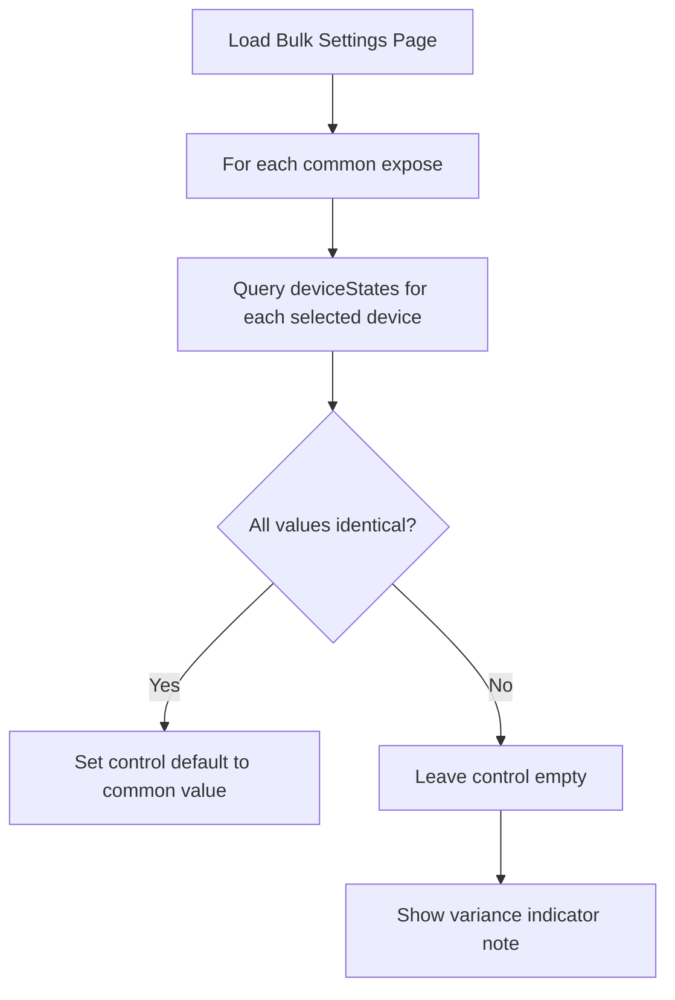
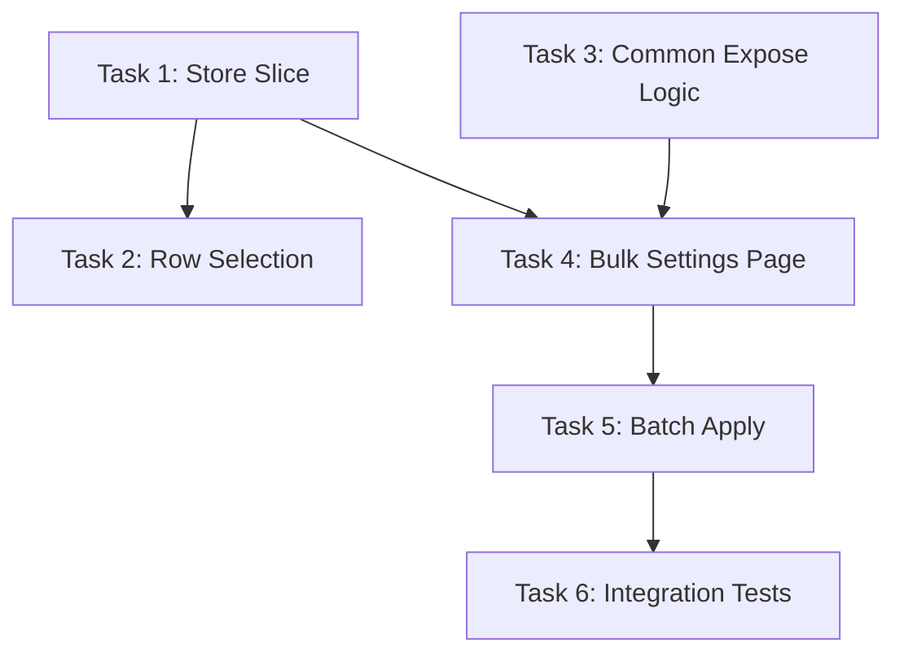

# Plan: Bulk Device Settings Management

## Original Work Order

> Add a new feature to enable bulk management of common settings across multiple devices. For example, a user should be able to check off devices, and then set a setting like the power-on behaviour after a power loss. The settings available should be based off of common exposes definitions, and not specific models so the same value can be set across varying models of devices.

## Plan Clarifications

| Question | Answer |
|----------|--------|
| Where should the bulk settings UI be accessible from? | Devices page for selection, then navigate to a dedicated Bulk Settings page for editing |
| Which types of settings should be available? | Expose features only (power_on_behavior, sensitivity, LED indicators, etc.) |
| How should common settings be determined? | Exact match by feature name AND type - features must share the same name and same type/value constraints |
| How should current values be displayed? | Query each device for current value; if all match, show that as default; if values differ, show no default with a note indicating variance |

## Executive Summary

This plan introduces a bulk device settings feature that allows users to select multiple devices from the Devices page and navigate to a dedicated page where they can modify common expose settings across all selected devices simultaneously.

The approach leverages existing patterns in the codebase: TanStack React Table's row selection (already used in ReportingPage and BindingsPage), the established Feature component system for rendering expose controls, and the Promise.allSettled pattern for batch WebSocket operations. By computing the intersection of expose features with matching names and types, users only see settings that can be safely applied to all selected devices.

This feature addresses a common pain point for users with many similar devices (e.g., multiple smart plugs or switches) who currently must configure each device individually.

## Context

### Current State vs Target State

| Current State | Target State | Why? |
|---------------|--------------|------|
| Users configure device settings one at a time | Users can select multiple devices and configure common settings in bulk | Reduces repetitive work for users with many similar devices |
| Devices page has no selection mechanism | Devices page has row selection with checkboxes | Enables multi-device operations |
| No dedicated bulk settings page exists | New Bulk Settings page shows common exposes for selected devices | Provides focused UI for bulk configuration with adequate screen space |
| Each device setting change is a separate action | Bulk changes are applied to all selected devices in parallel | Improves efficiency and user experience |
| No visibility into current values across devices | Settings show common value as default or indicate variance | Prevents accidental overwrites; provides context before changes |

### Background

The codebase already has established patterns for bulk operations:

- **ReportingPage** and **BindingsPage** implement row selection with TanStack React Table and batch actions using `Promise.allSettled()`
- **Feature components** (`src/components/features/*.tsx`) render individual expose controls and are reusable
- **WebSocket API** supports setting device values via `{ieee_address}/set` endpoint with transaction tracking
- **Expose definitions** contain `name`, `type`, `access`, and value constraints that can be compared for compatibility

The strict matching requirement (same name AND type/constraints) ensures that when a user sets a value, it will be valid for all selected devices. For example, if two devices both have `power_on_behavior` but with different enum values, they would not appear as a common setting.

## Architectural Approach

### Device Selection on Devices Page

**Objective**: Enable users to select multiple devices for bulk operations without disrupting the existing page functionality.

The Devices page table will be enhanced with row selection capabilities using the existing `useTable` hook's `rowSelection` support. A checkbox column will be added as the first column. When devices are selected, a contextual toolbar appears with a "Bulk Settings" button. Clicking this button stores the selected device identifiers and navigates to the dedicated bulk settings page.

Selected devices will be stored in the Zustand store to persist across navigation. Only the IEEE addresses need to be stored since full device data can be retrieved from the existing `devices` state.

### Common Expose Computation

**Objective**: Determine which expose features are common across all selected devices with compatible types and constraints.

The system will iterate through all selected devices' expose definitions and compute the intersection. For a feature to be considered "common":

1. All selected devices must have a feature with the exact same `name`
2. All features must have the same `type` (binary, enum, numeric, etc.)
3. For enum types: all devices must have the exact same set of allowed values
4. For numeric types: ranges must be compatible (intersection of min/max)
5. The feature must have SET access (`access & 0b010`)

Features will be grouped by category (if available) or presented in a flat list. Each common feature shows how many devices it applies to (should be 100% for strict matching).

### Bulk Settings Page

**Objective**: Provide a dedicated interface for viewing and modifying common settings across selected devices.

The page will display:
- A summary header showing the count and list of selected devices
- A list of common expose features rendered using existing Feature components
- An apply mechanism for each setting (or batch apply for multiple changes)

The existing Feature components (`Binary`, `Enum`, `Numeric`, etc.) will be reused with a modified `onChange` handler that applies to all selected devices. The page will show which devices will be affected and provide feedback on the operation results.

### Current Value Detection

**Objective**: Show intelligent defaults based on current device states, with clear indication when values differ.

When the Bulk Settings page loads, the system will query the current state of each selected device for each common expose feature. The display logic:

1. **Uniform values**: If all selected devices have the same current value for a setting, pre-populate the control with that value as the default
2. **Mixed values**: If values differ across devices, show the control with no value selected and display a subtle note (e.g., "Current setting varies across selected devices")
3. **Unknown values**: If some devices don't have a current state available, treat as mixed/unknown

This approach ensures users understand the current state before making changes and avoids accidentally overwriting intentionally different configurations.

### Batch WebSocket Operations

**Objective**: Apply setting changes to all selected devices efficiently with proper error handling.

When a user changes a setting value, the system will:
1. Construct the payload for each selected device
2. Send all requests in parallel using `Promise.allSettled()`
3. Collect results (fulfilled/rejected) for each device
4. Display a summary toast showing success count and any failures
5. Update local state to reflect changes

This follows the established pattern in `ReportingPage.tsx` where batch operations are already implemented.

### State Management

**Objective**: Manage selected devices across page navigation and coordinate with existing store patterns.

A new slice will be added to the Zustand store to track bulk operation state:
- `bulkSelectedDevices`: Array of IEEE addresses (per source index for multi-instance support)
- Actions to set/clear selection

The selection state will be cleared after successful bulk operations or when the user navigates away from the bulk settings flow.

## Risk Considerations and Mitigation Strategies

Technical Risks

- **Feature compatibility edge cases**: Some features may have the same name but subtly different behaviors across device models
    - **Mitigation**: Strict type and constraint matching; show device count affected by each setting

- **Large batch operations**: Applying changes to many devices simultaneously could overwhelm the WebSocket connection
    - **Mitigation**: Use existing transaction-based API with proper timeout handling; consider chunking for very large selections (50+ devices)

Implementation Risks

- **Multi-instance complexity**: The application supports multiple Zigbee2MQTT instances; bulk operations must respect source boundaries
    - **Mitigation**: Store selections per `sourceIdx`; only allow bulk operations within a single source

- **State synchronization**: Device state may change while user is on bulk settings page
    - **Mitigation**: Subscribe to device state updates; show stale data warnings if device definitions change

## Success Criteria

### Primary Success Criteria

1. Users can select multiple devices on the Devices page using checkboxes
2. Users can navigate to a Bulk Settings page showing only common expose features
3. Settings with uniform values across devices show that value as the default; settings with mixed values show no default with a variance indicator
4. Changing a setting applies the value to all selected devices via WebSocket
5. Users receive clear feedback on which devices were updated successfully

## Resource Requirements

### Development Skills

- front-end javascript
- front-end css and html

### Technical Infrastructure

- javascript
- typescript
- vite
- tailwind
- react

## Integration Strategy

- this project is a front end built on the websocket API of zigbee2mqtt.

## Task Dependency Graph

## Execution Blueprint

**Validation Gates:**
- Reference: `/config/hooks/POST_PHASE.md`

### Phase 1: Foundation
**Parallel Tasks:**
- Task 1: Add bulk selection store slice
- Task 3: Implement common expose computation logic

### Phase 2: UI Integration
**Parallel Tasks:**
- Task 2: Add device row selection to Devices page (depends on: 1)
- Task 4: Create Bulk Settings page (depends on: 1, 3)

### Phase 3: Feature Completion
**Parallel Tasks:**
- Task 5: Implement batch apply with feedback (depends on: 4)

### Phase 4: Quality Assurance
**Parallel Tasks:**
- Task 6: Add integration tests for bulk settings flow (depends on: 5)

### Execution Summary
- Total Phases: 4
- Total Tasks: 6
- Maximum Parallelism: 2 tasks (in Phases 1 and 2)
- Critical Path Length: 4 phases (1 → 4 → 5 → 6)
